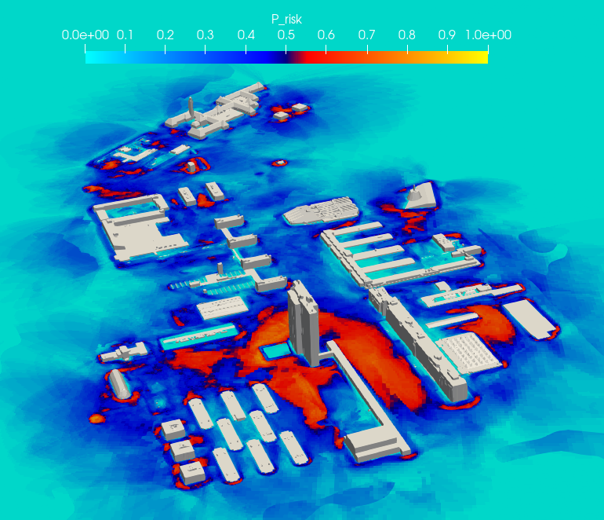

# riskMap

This OpenFOAM utility computes a risk map using a non-dimensional velocity, alpha, and beta input parameters 

## How to compile?

- Copy the `riskMap` directory to `$HOME/OpenFOAM/<user>-<version>/applications/utilities/`. Replace `<user>` with your username and `<version>` with your version name.
- Compile the application by typing `wmake`

## How to use the utility

- Arrange the results of various wind directions .or. time results (either way its a risk over time/direction that is averaged) into different directories in serial `1`,`2`,`3`, so on ...
- Choose the right parameters in `flowProperties` and place this file in `constant`
- Make sure deltaT, startTime, endTime are set according to the way the results are arranged so each timestep is one snapshot
- Place the `windRose.dat` file in `constant` directory with the file contents such that the total number of snapshots are equal to the elements in the data file.
- Run `riskMap`

## A case for urban fluid dynamics applications

- This utility was mainly designed to compute the directional averages and risk when simulating steady-RANS with multiple wind-incidences. Consequently, this would need some sort of a data-reduction/averaging methodology, thus we wrote the riskMap utility.
- Say all your 3D snapshots are stored in a directory as `results/fields_5`, `results/fields_10`, and so on until `results/fields_360`, corresponding to the 3D snapshots at various wind incidence angles. 
- Now you can use `copyresults4riskmap.sh` to copy only the `U` and `k` parameters to time directories.
- Run the `riskMap` utility and the results will be stored in `endTime + deltaT` directory.
- Example, each directory will have its own binary risk map while the averaged risk ($\mathcal{P}_r$), wind-rose averaged velocity ($\overline{U}_a$) and TKE ($\overline{k}_a$) will be stored in a directory `365` when using an angular resolution of $\Delta \theta = 5^{\circ}$.

 
Figure: Results that can be obtained using this utility which are paraview compatible through the OpenFOAM filetype natively. Here the directionally averaged risk is shown at 10m height with red marking high risk and blue marking low risk regions.

### This code was written listening to the wonderful album `Àmr` by Ihsahn
